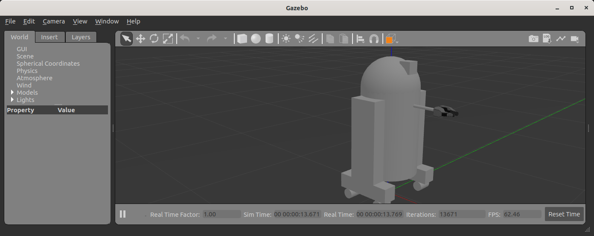
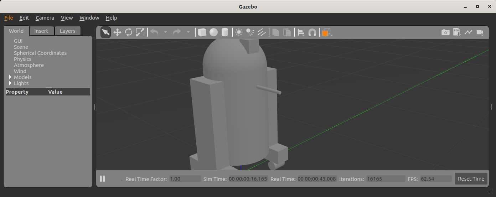
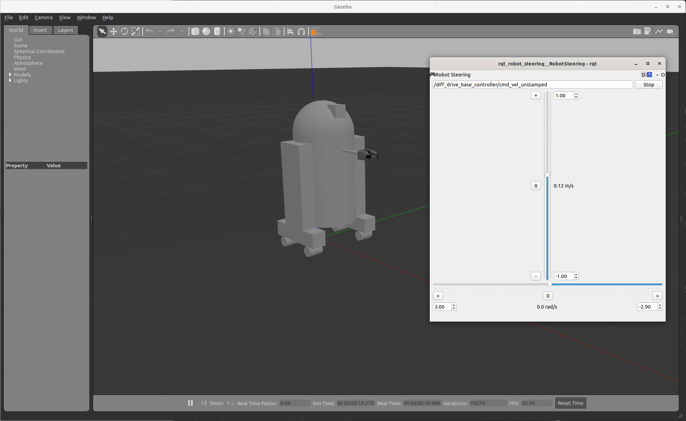

# urdf_sim_tutorial
See the tutorials over at http://wiki.ros.org/urdf_tutorial

Please download the URDF simulation tutorial from [github](https://github.com/ros/urdf_sim_tutorial) or using a package manager

    sudo apt install ros-$ROS_DISTRO-urdf-sim-tutorial

## Nonfunctional Gazebo Interface
We can spawn the model we already created into Gazebo using `gazebo.launch.py`

    ros2 launch urdf_sim_tutorial gazebo.launch.py

This launch file

 * Loads the urdf from [the macro tutorial](https://docs.ros.org/en/ros2_documentation/iron/Tutorials/Intermediate/URDF/Using-Xacro-to-Clean-Up-a-URDF-File.html) and publishes it as a topic (`/robot_description`)
 * Launches an empty Gazebo world
 * Runs the script to read the urdf from the topic and spawn it in Gazebo.
 * By default, the Gazebo GUI will also be displayed, and look like this:



However, it doesn't do anything, and is missing lots of key information that ROS would need to use this robot. Previously we had been using [joint_state_publisher](http://wiki.ros.org/joint_state_publisher) to specify the pose of each joint. However, the robot itself should provide that information in the real world or in Gazebo. Yet without specifying that, Gazebo doesn't know to publish that information.

To get the robot to be interactive (with you and ROS), we need to specify two things: Plugins and Transmissions.

### Side note: Configuring Meshes


If you are following along at home with your own robot, or something else is amiss, the meshes may be missing from your model in the Gazebo GUI (i.e. the gripper meshes are not there). This may also cause Gazebo to take several seconds to start up after the splash screen appears because it is checking the internet for missing models.

This is because your URDF package needs to explicitly tell Gazebo where to load the meshes from. We do this by modifying the `package.xml` of the package where our URDF meshes live to include a new export.

```xml
  <export>
    <build_type>ament_cmake</build_type>
    <gazebo_ros gazebo_model_path="${prefix}/.."/>
  </export>
```

[The reasoning behind the exact value of the `gazebo_model_path` attribute is a separate issue](https://github.com/ros-simulation/gazebo_ros_pkgs/issues/1500), but suffice to say, setting it to this value will work assuming
 * Your mesh filenames are specified in the URDF using the `package://package_name/possible_folder/filename.ext` syntax.
 * The meshes are installed (via CMake) into the proper share folder.

## Gazebo Plugin
To get ROS 2 to interact with Gazebo, we have to dynamically link to the ROS library that will tell Gazebo what to do. Theoretically, this allows for other Robot Operating Systems to interact with Gazebo in a generic way. In practice, its just ROS.

Specifically, Gazebo / ROS 2 interaction all happens by linking to a ROS 2 Control library, with new URDF tags.

We specify the following in the URDF, right before the closing `</robot>` tag:

```xml
  <ros2_control name="GazeboSystem" type="system">
    <hardware>
      <plugin>gazebo_ros2_control/GazeboSystem</plugin>
    </hardware>
    <joint name="head_swivel" />
  </ros2_control>

  <gazebo>
    <plugin filename="libgazebo_ros2_control.so" name="gazebo_ros2_control">
      <parameters>$(find urdf_sim_tutorial)/config/09a-minimal.yaml</parameters>
    </plugin>
  </gazebo>
```

Notes:
 * The `<gazebo>` and `<plugin>` tags work the same way they did in ROS 1.
 * We must specify at least one joint for the minimal example to work, but we'll add more later.

The minimal configuration file is:

```yaml
controller_manager:
  ros__parameters:
    update_rate: 100
```


You can see this in [09a-minimal.urdf.xacro](urdf/09a-minimal.urdf.xacro) and by running

    ros2 launch urdf_sim_tutorial 09a-minimal.launch.py

This starts up a `/controller_manager` node and with the `load_controller` service, but doesn't add any immediately useful interaction with the robot. For that we need to specify more information in the controller yaml.

## Spawning Controllers
Now that we've linked ROS and Gazebo, we need to specify some bits of ROS code that we want to run within Gazebo, which we generically call controllers. Now we can look at a larger example based on [this yaml file](config/joints.yaml) that specifies our first controller.

```yaml
controller_manager:
  ros__parameters:
    update_rate: 100
    use_sim_time: true

    joint_state_broadcaster:
      type: joint_state_broadcaster/JointStateBroadcaster
```
This controller is found in the `joint_state_broadcaster` package and publishes the state of the robot's joints into ROS directly from Gazebo.

In [09-joints.launch.py](launch/09-joints.launch.py) we also add a `ros2_control` command via `ExecuteProcess` to start this specific controller.

You can launch this, but its still not quite there.

    ros2 launch urdf_sim_tutorial 09-joints.launch.py

This will run the controller and in fact publish on the `/joint_states` topic, but with nothing in them.

```yaml
header:
  stamp:
    sec: 13
    nanosec: 331000000
  frame_id: ''
name: []
position: []
velocity: []
effort: []
```

What else do you want Gazebo!? Well, it wants to know more information about the joints.

## ROS 2 Control Joint Definitions
For every non-fixed joint, we need to add information about the joint in the `ros2_control` tag which tells it what interfaces are supported. Let's start with the head joint. Modify the joint tag in your [URDF](urdf/10-firsttransmission.urdf.xacro#L241) to be the following:

```xml
    <joint name="head_swivel">
      <command_interface name="position" />
      <command_interface name="velocity" />
      <state_interface name="position"/>
      <state_interface name="velocity"/>
    </joint>
```
 * Note that the joint name here matches the joint name from the standard URDF `<joint>` tag.
 * For the moment, let us focus on the `state_interface`s, in which we specify that we want to publish both position and velocity of this joint.

You can run this URDF with our previous launch configuration.

    ros2 launch urdf_sim_tutorial 09-joints.launch.py urdf_package_path:=urdf/10-firsttransmission.urdf.xacro

Now, the head is displayed properly in RViz because the head joint is listed in the `joint_states` messages.

```yaml
header:
  stamp:
    sec: 4
    nanosec: 707000000
  frame_id: ''
name:
- head_swivel
position:
- -2.9051283156888985e-08
velocity:
- 7.575990694887896e-06
effort:
- .nan
```

We could continue adding transmissions for all the non-fixed joints (and we will) so that all the joints are properly published. But, there's more to life than just looking at robots. We want to control them. So, let's get another controller in here.

## Joint Control
[Here's](config/head.yaml) the next controller config we're adding.

```yaml
controller_manager:
  ros__parameters:
    # ... snip ...

    head_controller:
      type: position_controllers/JointGroupPositionController

head_controller:
  ros__parameters:
    joints:
      - head_swivel
    interface_name: position
```

In English, this is saying to add a new `JointGroupPositionController`called `head_controller`, and then, in a new parameter namespace, specify which joints are included and that we are publishing positions. We can do this because we specified `<command_interface name="position" />` in the joint tag.

Now we can launch this with the added config and another `ros2 control` command as before

    ros2 launch urdf_sim_tutorial 10-head.launch.py

Now Gazebo is subscribed to a new topic, and you can then control the position of the head by publishing a value in ROS.

    ros2 topic pub /head_controller/commands std_msgs/msg/Float64MultiArray "data: [-0.707]"

When this command is published, the position will immediately change to the specified value.

## Controlling Multiple Joints and Mimicking
We can change the URDF for the Gripper joints in a similar way, but in this case, we'll associate multiple joints with one controller. The updated [ROS parameters are here](config/gripper.yaml). We also must update [the URDF to include three additional joint interfaces](urdf/12-gripper.urdf.xacro).

To launch this,

    ros2 launch urdf_sim_tutorial 12-gripper.launch.py

We can now move the gripper with an array of three floats. Open and out:

    ros2 topic pub /gripper_controller/commands std_msgs/msg/Float64MultiArray "data: [0.0, 0.5, 0.5]"

Closed and retracted:

    ros2 topic pub /gripper_controller/commands std_msgs/msg/Float64MultiArray "data: [-0.4, 0.0, 0.0]"

This gripper is actually set up in a way that we ALWAYS want the left gripper joint to have the same value as the right gripper joint. We can code this into the URDF and controllers with a few steps.

 * Insert `<mimic joint="left_gripper_joint"/>` into the URDF definition of the `right_gripper_joint` (which is done a bit hackily in [the xacro here](urdf/12a-mimic-gripper.urdf.xacro)
 * Insert `<param name="mimic">left_gripper_joint</param>` into the `ros2_control` joint interface for `right_gripper_joint`.
 * In our new [control parameters](config/mimic-gripper.urdf), we only list the two joints for the gripper controller, leaving out `right_gripper_joint`.

We can launch this with

    roslaunch urdf_sim_tutorial 12-gripper.launch.py urdf_package_path:=urdf/12a-mimic-gripper.urdf.xacro

and now we can control it with just two values, e.g.

    ros2 topic pub /gripper_controller/commands std_msgs/msg/Float64MultiArray "data: [0.0, 0.5]"

## The Wheels on the Droid Go Round and Round
To drive the robot around, we first must specify more interfaces in the `ros2_control` tag of [the URDF for each of the four wheels](urdf/13-diffdrive.urdf.xacro), however, now only the velocity command interface is required.

We could specify controllers for each of the individual wheels, but where's the fun in that? Instead we want to control all the wheels together. For that, we're going to need [a lot more ROS parameters](config/diffdrive.yaml) to make use of the `DiffDriveController` which subscribes to a standard Twist `cmd_vel` message and moves the robot accordingly.

    ros2 launch urdf_sim_tutorial 13-diffdrive.launch.py

In addition to loading the above configuration, this also opens the !RobotSteering panel, allowing you to drive the R2D2 robot around, while also observing its actual behavior (in Gazebo) and it's visualized behavior (in RViz):



Congrats! Now you're simulating robots with URDF.
